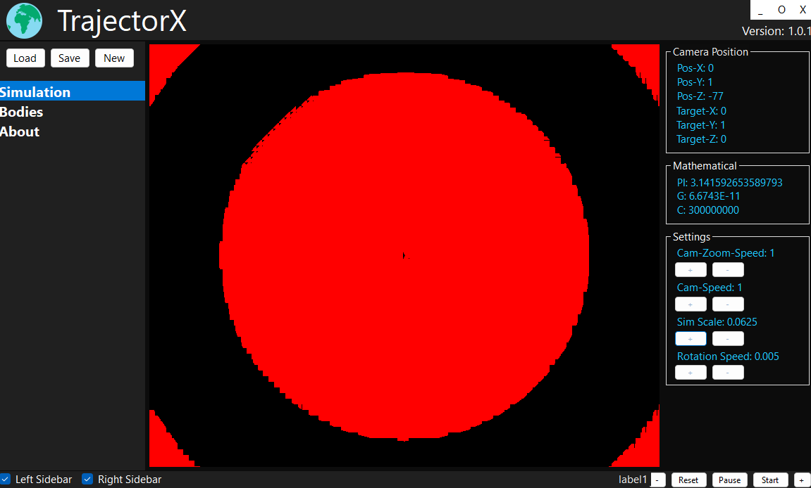

# TrajectorX

Simulating Space Physics—Work in Progress

!!! WARNING "This project is unfinished and still in development—it is currently not usable for practical purposes."

-----------

## Introduction

An experimental C# project focused on simulating space physics, including gravitational interactions and basic celestial mechanics. This software is still in early development as a hobby, with many features unfinished and no planned release date. Contributions and feedback are welcome as the project evolves.

  

